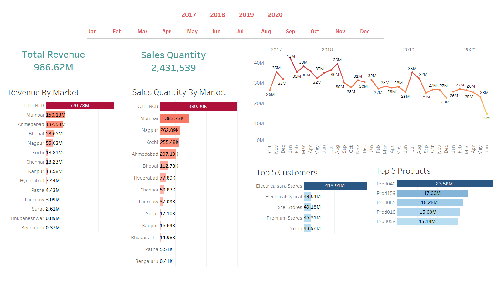
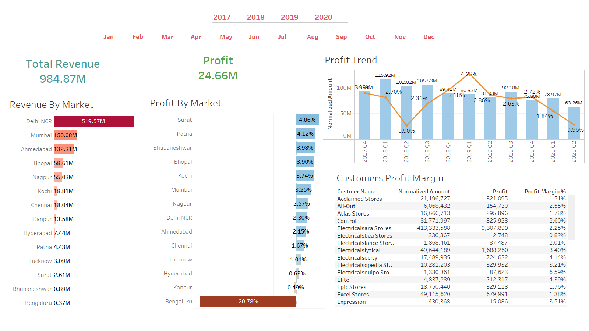

# Tableau-Sales-Insights-Project

A-Z  Tableau project for real life use case of extractingsales insights for a hardware supplier company.

## Table of Contents

* [Motivation](#motivation)
* [About the Data](#about-the-data)
* [Challanges](#challenges)
* [A Look at our Dashboards](#a-look-at-our-dashboards)
* [Acknowledgements](#acknowledgements)

## Motivation

Consolidate my previous knowledge of SQL, Data Cleaning, and Tableau to extract insights and create info-telling dashboards.

## About the Data

We have five csv files:

* transactions: contains sales quantity and amount for different products in different markets spanned from 2017 to 2020
* customers: contains the names of the stores that buy the hardware
* date: contains date of the transactions
* markets: contains the regions of distribution
* products: contains products code and types.

## Challenges

* Data Cleaning in MySQL 
* ETL in Tableau

## A Look at our Dashboards

## Acknowledgements

This is a re-implementation of codebasics repo on github:

[Repo Link](https://github.com/codebasics/DataAnalysisProjects/tree/master/2_SalesInsightsTableau)
